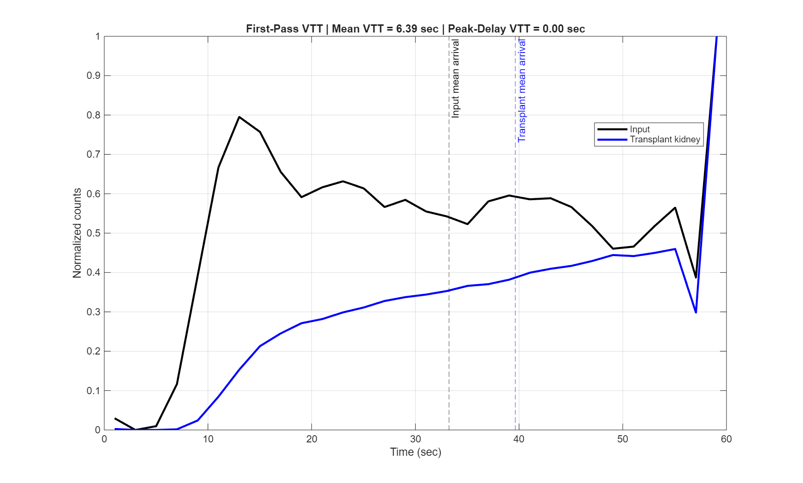
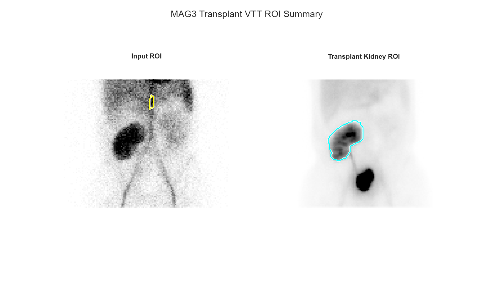

# Renal Transplant MAG3 Vascular Transit Time MATLAB Pipeline

## Overview

This repository provides a MATLAB workflow for quantifying vascular transit time (VTT) in renal transplant recipients using dynamic Tc-99m MAG3 renography.

The pipeline extracts an image-derived vascular input function and transplant kidney time-activity curve (TAC), then estimates vascular transit time using:

1. Mean VTT (Centroid / Mean Arrival Time Method)
2. Peak-Delay VTT

The workflow automatically saves figures and exports numerical results in CSV and MAT formats.
## Example Output




---

## Main Outputs

- Vascular/input ROI
- Transplant kidney ROI
- Input time-activity curve
- Transplant kidney time-activity curve
- First-pass normalized TAC plot
- Input mean arrival time
- Transplant kidney mean arrival time
- Mean VTT using centroid method
- Peak-delay VTT
- CSV summary output
- MAT results file

---

## Workflow

Dynamic MAG3 DICOM  
↓  
Vascular/input ROI  
↓  
Transplant kidney ROI  
↓  
First-pass TAC extraction  
↓  
Mean arrival time calculation  
↓  
Peak-delay calculation  
↓  
Vascular transit time estimation  
↓  
CSV and MAT export  

---

## Methods

Two VTT metrics are generated.

### 1. Mean VTT (Centroid Method)

The centroid, or mean arrival time, of the input curve and transplant kidney curve is calculated over the early first-pass window.

```text
Mean VTT = Transplant kidney mean arrival time − Input mean arrival time
## Example ROI Output


## Example VTT Analysis


